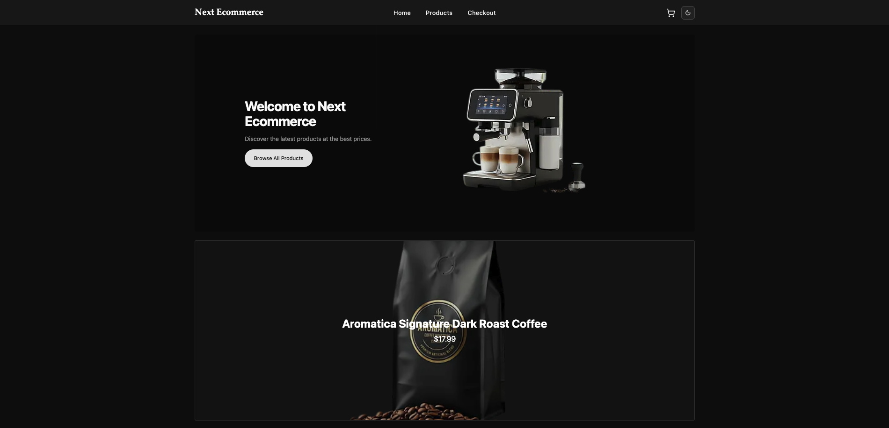

# Next Ecommerce

The name “Inventarium” comes from Classical Latin, derived from “inventarium” (meaning inventory, list, or detailed account of items), itself rooted in “invenire” — “to find” or “to discover.”

A modern inventory management system to track, analyze, and optimize your stock in real time.

Inventarium is a full-stack inventory management application built with Next.js, Prisma, and PostgreSQL. It provides features for tracking products, monitoring stock levels, and visualizing inventory analytics.



## Features

- **Responsive Design::** Fully mobile-friendly and optimized for different screen sizes.
- **Product Listing:** Browse all available products with product name or description filtering.
- **Product Details:** View product information, including images, description, and price.
- **Add to Cart:** Select products and manage items in the shopping cart.
- **Secure Payments:** Users can complete purchases safely with integrated Stripe payment processing.

## Folder Structure

```
inventarium/
├── app/        # Next.js App Router pages & routes
├── components/ # Reusable UI components
├── lib/        # Helper functions, Stripe configuration
├── public/     # Static assets
└── store/      # State management for store's products
```

## Tech Stack

- **Framework:** [Next.js](https://nextjs.org/) (App Router)
- **Language:** [TypeScript](https://www.typescriptlang.org/)
- **Styling:** [Tailwind CSS](https://tailwindcss.com/)
- **UI Components:** [Shadcn UI](https://ui.shadcn.com/)
- **State Management:** [Zustand](https://zustand-demo.pmnd.rs/)
- **Payments:** [Stripe](https://stripe.com/)

## Getting Started

Follow these instructions to get a copy of the project up and running on your local machine for development and testing purposes.

### Prerequisites

- Node.js (v18 or later)
- npm, yarn, or pnpm
- A PostgreSQL database

### Installation

1.  **Clone the repository:**

    ```bash
    git clone https://github.com/your-username/next-ecommerce.git
    cd next-ecommerce
    ```

2.  **Install dependencies:**

    ```bash
    npm install
    ```

3.  **Set up environment variables:**
    Create a `.env` file in the root of your project and add the following variables. You can get the Stripe variables from your Stripe project dashboard.

    ```env
    # Stripe secret key
    STRIPE_SECRET_KEY="your_stripe_secret_key"

    # Base URL of your deployed app
    NEXT_PUBLIC_BASE_URL="https://your-app-url.vercel.app"
    ```

4.  **Run the development server:**
    ```bash
    npm run dev
    ```

Open [http://localhost:3000](http://localhost:3000) with your browser to see the result.

## Deploy on Vercel

The easiest way to deploy your Next.js app is to use the [Vercel Platform](https://vercel.com/new?utm_medium=default-template&filter=next.js&utm_source=create-next-app&utm_campaign=create-next-app-readme) from the creators of Next.js.

Check out the [Next.js deployment documentation](https://nextjs.org/docs/app/building-your-application/deploying) for more details.
